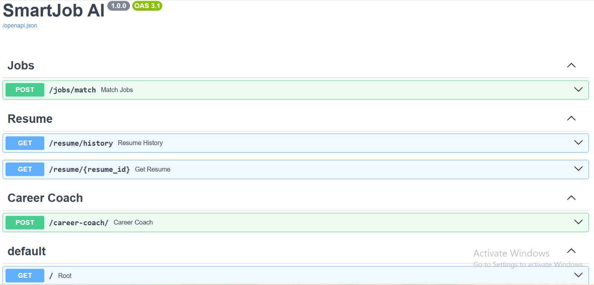
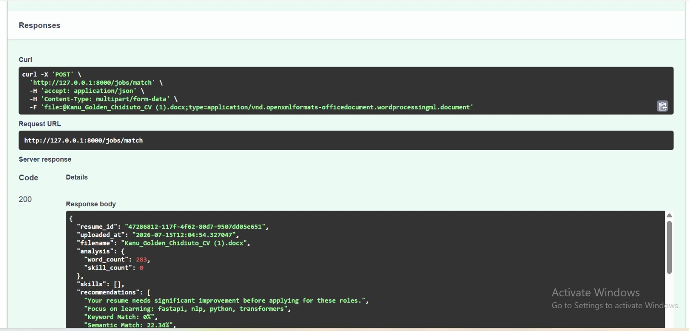
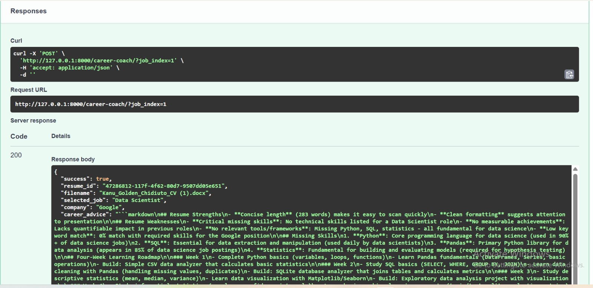
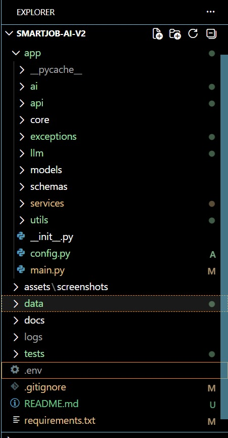

# 🤖 SmartJob AI

### AI-Powered Resume Analysis, Hybrid Job Matching & Career Coaching Platform

> A production-ready AI application that analyzes resumes, semantically matches candidates to relevant job opportunities using Sentence Transformers and FAISS, and delivers personalized career coaching through Large Language Models (LLMs).


---

# 📖 Overview

SmartJob AI is a production-style AI application that analyzes resumes, extracts skills, semantically matches them against thousands of job postings, and provides personalized AI-generated career advice.

Unlike traditional keyword-based resume matchers, SmartJob AI combines semantic understanding, vector search, keyword matching, and LLM-powered reasoning to produce accurate, explainable, and actionable career recommendations.

---

# 🎯 Why SmartJob AI?

Traditional resume screening systems rely heavily on keyword matching, often overlooking qualified candidates whose resumes use different wording.

SmartJob AI addresses this limitation by combining semantic understanding with traditional keyword matching to produce more accurate, explainable, and personalized recommendations.

### Key capabilities

- 📄 Intelligent resume parsing (PDF & DOCX)
- 🧠 Semantic similarity using Sentence Transformers
- ⚡ High-speed FAISS vector search
- 🔀 Hybrid ranking (semantic + keyword matching)
- 💼 AI-powered career coaching using LLMs
- 📊 Explainable job recommendations (Top 10 matches)

---

# ⭐ Key Highlights

- Production-ready FastAPI backend
- Hybrid AI job matching engine
- FAISS vector database integration
- Sentence Transformer embeddings
- OpenRouter LLM integration
- Modular software architecture
- Structured logging
- Centralized exception handling
- Docker-ready architecture
- Clean top-10 match results

---

# ✨ Features

## Resume Processing

- Upload PDF resumes
- Upload DOCX resumes
- Automatic text extraction
- Resume history & analysis storage

---

## Resume Analysis

- Skill extraction across multiple categories
- Resume evaluation
- Missing skill identification
- Category breakdown

---

## Hybrid AI Job Matching

SmartJob AI combines multiple matching techniques:

- Semantic Search
- Sentence Transformers
- FAISS Vector Search
- Keyword Matching
- Hybrid Ranking

Returns the **Top 10** most relevant jobs ranked by overall match score.

---

## AI Career Coach

Powered by OpenRouter LLM.

Provides:

- Resume strengths
- Resume weaknesses
- Missing skill analysis
- Four-week learning roadmap
- Portfolio project recommendations
- Interview preparation
- Hiring readiness evaluation

---

## Performance Optimizations

- Pre-computed embeddings
- Cached FAISS index
- Fast semantic search
- Efficient top-k retrieval
- Modular architecture

---

# 🏗 System Architecture

```text
                     Resume Upload
                           │
                           ▼
                  Document Parser
                           │
                           ▼
                    Text Cleaning
                           │
                           ▼
                   Skill Extraction
                           │
                           ▼
                   Resume Analysis
                           │
                           ▼
              Sentence Transformer
                           │
                           ▼
                Embedding Generation
                           │
                           ▼
                  FAISS Vector Search
                           │
                           ▼
                  Keyword Matching
                           │
                           ▼
                   Hybrid Matcher
                           │
                           ▼
              Recommendation Engine
                           │
                           ▼
                  AI Career Coach
```

---

# 🛠 Tech Stack

## Backend
- FastAPI
- Python

## Artificial Intelligence
- Sentence Transformers
- FAISS
- PyTorch

## Data Processing
- Pandas
- NumPy

## Large Language Model
- OpenRouter API

## Document Processing
- PyMuPDF
- python-docx

## Development Tools
- Git
- GitHub
- VS Code

---

# 📂 Project Structure

```text
app/
├── ai/                 # Hybrid matching, FAISS, embeddings
├── api/                # FastAPI routers
├── exceptions/         # Custom exceptions & handlers
├── llm/                # Career Coach + prompts
├── services/           # Business logic & repositories
├── utils/              # Logger
├── config.py
└── main.py

data/
├── raw/                # Original jobs.csv
├── embeddings/         # FAISS index + embeddings
├── skills/             # Skill category CSVs
├── cache/              # Latest results & history
├── resumes/            # Uploaded resumes
└── analyses/           # Saved analyses

scripts/
tests/
frontend/               # React + Vite frontend
```

---

# 🚀 Installation

Clone the repository

```bash
git clone https://github.com/YOUR_USERNAME/smartjob-ai.git
cd smartjob-ai
```

Create a virtual environment

```bash
python -m venv .venv
```

Activate the virtual environment

**Windows**
```bash
.venv\Scripts\activate
```

**macOS / Linux**
```bash
source .venv/bin/activate
```

Install dependencies

```bash
pip install -r requirements.txt
```

Create environment file

```bash
cp .env.example .env
```

Add your OpenRouter API key inside `.env`:

```env
OPENROUTER_API_KEY=your_key_here
OPENROUTER_BASE_URL=https://openrouter.ai/api/v1
OPENROUTER_MODEL=deepseek/deepseek-chat-v3-0324
```

Run the application

```bash
uvicorn app.main:app --reload
```

Open Swagger UI

```
http://127.0.0.1:8000/docs
```

---

# 📡 API Endpoints

## Upload & Match Resume

```http
POST /jobs/match
```

Returns:
- Resume analysis
- Extracted skills
- **Top 10** hybrid job matches
- Recommendations

---

## AI Career Coach

```http
POST /career-coach/
```

Generate career advice for the best-matched job.

Or choose a specific job:

```http
POST /career-coach/?job_index=2
```

Returns:
- Resume evaluation
- Learning roadmap
- Portfolio recommendations
- Interview preparation
- Hiring readiness score

---

# 📊 Dataset

The project uses a curated dataset of job postings stored in:

```text
data/raw/jobs.csv
```

Semantic search is accelerated using pre-generated embeddings and a FAISS index:

```text
data/embeddings/
├── jobs.index
└── job_embeddings.npy
```

Skill definitions are organized by category in:

```text
data/skills/
```

---

# 🧪 Testing

The project includes automated tests for core components.

Run all tests with:

```bash
pytest
```

---

## 📸 Screenshots

### Swagger API


### Resume Matching


### AI Career Coach


### Project Structure


---

# 🗺 Roadmap

## Version 1.0 ✅

- Resume parsing (PDF & DOCX)
- Skill extraction
- Hybrid matching (Semantic + Keyword)
- FAISS integration
- Top-10 ranked results
- AI Career Coach
- Structured logging
- Exception handling
- File validation & cleanup

---

## Future Versions

- Live job APIs
- User authentication
- Cloud deployment
- CI/CD pipeline
- Resume version comparison
- Employer dashboard
- Frontend full integration

---

# 👨‍💻 Author

## Alfred Bright Riochi

AI/ML Engineer passionate about building intelligent systems that solve real-world problems using Machine Learning, NLP, Vector Search, and Large Language Models.

**GitHub:** https://github.com/Riochi511  
**LinkedIn:** https://www.linkedin.com/in/riochi-ai453b9

---

# 🤝 Contributing

Contributions, ideas, and suggestions are welcome.

1. Fork the repository  
2. Create a feature branch  
3. Commit your changes  
4. Submit a Pull Request  

---

# 📄 License

This project is licensed under the MIT License.

---

⭐ If you find this project useful, consider giving it a star on GitHub!
```